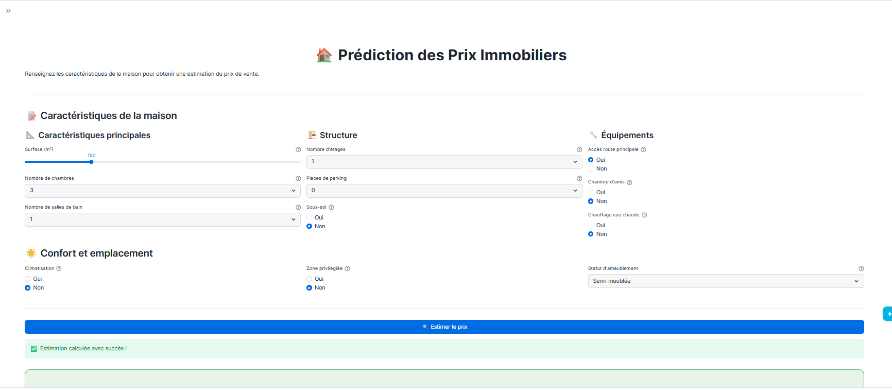

# Prédiction des Prix Immobiliers avec Snowflake

[](https://www.snowflake.com/)
[](https://streamlit.io/)
[](https://scikit-learn.org/)

## Table des Matières

- [Description](#description)
- [Architecture](#architecture)
- [Dataset](#dataset)
- [Pipeline ML](#pipeline-ml)
- [Model Registry](#model-registry)
- [Application Streamlit](#application-streamlit)
- [Installation et Configuration](#installation-et-configuration)
- [Utilisation](#utilisation)
- [Structure du Repository](#structure-du-repository)
- [Technologies Utilisées](#technologies-utilisées)
- [Contribuer](#contribuer)
- [Licence](#licence)

## Description

Ce projet a été réalisé dans le cadre du workshop **Data Engineering et Machine Learning avec Snowflake**.

L'objectif est de construire un pipeline complet de Data Engineering et Machine Learning directement dans Snowflake, sans déplacer les données vers un environnement externe. Le pipeline permet de prédire le prix de vente d'une maison en fonction de ses caractéristiques (surface, nombre de chambres, équipements, etc.).

---

## Architecture

Le projet repose sur une **architecture Medallion** à 3 couches :

```
S3 (JSON)
   │
   ▼
BRONZE — Données brutes JSON (VARIANT), sans transformation
   │
   ▼
SILVER — Typage des colonnes, renommage en français, imputation des nulls
   │
   ▼
GOLD   — Encodage des variables catégorielles (0/1, ordinal)
   │
   ▼
ML     — Modèles enregistrés, prédictions, Registry
```
---

## Dataset

- **Source** : `s3://logbrain-datalake/datasets/house_price/`
- **Format** : JSON
- **Nombre de lignes** : 1 090
- **Nombre de features** : 12

| Colonne | Description |
|---|---|
| PRIX | Prix de vente de la maison (variable cible) |
| SURFACE | Surface totale en m² |
| CHAMBRES | Nombre de chambres |
| SALLES_DE_BAIN | Nombre de salles de bain |
| ETAGES | Nombre d'étages |
| PARKING | Nombre de places de stationnement |
| ROUTE_PRINCIPALE | Reliée à une route principale (0/1) |
| CHAMBRE_AMIS | Présence d'une chambre d'amis (0/1) |
| SOUS_SOL | Présence d'un sous-sol (0/1) |
| CHAUFFAGE_EAU_CHAUDE | Chauffage à eau chaude (0/1) |
| CLIMATISATION | Climatisation disponible (0/1) |
| ZONE_PRIVILEGIEE | Située dans une zone privilégiée (0/1) |
| STATUT_AMEUBLEMENT_ENC | État d'ameublement (0=non meublé, 1=semi-meublé, 2=meublé) |

---

## Pipeline ML

### Préparation des données
- Split train/test : **80% / 20%** (872 / 218 échantillons)
- Normalisation via `StandardScaler` intégrée dans un **Pipeline sklearn**
- Aucun data leakage : le scaler est fitté uniquement sur les données d'entraînement

### Modèles entraînés
Trois familles d'algorithmes ont été comparées :

| Modèle | MAE | RMSE | R² | Accuracy | Precision | Recall |
|---|---|---|---|---|---|---|
| Random Forest | 19 587 | 32 513 | 0.8815 | 0.8670 | 0.8761 | 0.8662 |
| Gradient Boosting | 31 394 | 42 495 | 0.7975 | 0.7844 | 0.7891 | 0.7883 |
| Linear Regression | 40 253 | 53 985 | 0.6732 | 0.6972 | 0.7005 | 0.7062 |

> **Note sur les métriques** : Ce problème est une **régression** (prédiction d'un prix continu). Les métriques MAE, RMSE et R² mesurent la précision numérique des prédictions. Les métriques Accuracy, Precision et Recall sont calculées en discrétisant les prix en 3 classes (bas / moyen / élevé) basées sur les percentiles 33 et 66 du jeu d'entraînement.

### Optimisation — Grid Search
Le Gradient Boosting a été optimisé par **GridSearchCV** avec validation croisée 5-fold.

**Meilleurs hyperparamètres trouvés :**

| Hyperparamètre | Valeur | Rôle |
|---|---|---|
| n_estimators | 300 | Nombre d'arbres construits |
| max_depth | 7 | Profondeur maximale de chaque arbre |
| min_samples_split | 5 | Minimum d'échantillons pour diviser un nœud |
| min_samples_leaf | 2 | Minimum d'échantillons dans une feuille |

**Résultats avant / après optimisation :**

| Métrique | Avant | Après | Gain |
|---|---|---|---|
| MAE | 31 394 | 12 632 | -18 761 |
| RMSE | 42 495 | 29 707 | -12 788 |
| R² | 0.7975 | 0.9010 | +0.1035 |
| Accuracy | 0.7844 | 0.9220 | +0.1376 |
| Precision | 0.7891 | 0.9248 | +0.1357 |
| Recall | 0.7883 | 0.9234 | +0.1351 |

---
| CHAUFFAGE_EAU_CHAUDE | Chauffage à eau chaude (0/1) |
| CLIMATISATION | Climatisation disponible (0/1) |
| ZONE_PRIVILEGIEE | Située dans une zone privilégiée (0/1) |
| STATUT_AMEUBLEMENT_ENC | État d'ameublement (0=non meublé, 1=semi-meublé, 2=meublé) |

---

## Pipeline ML

### Préparation des données
- Split train/test : **80% / 20%** (872 / 218 échantillons)
- Normalisation via `StandardScaler` intégrée dans un **Pipeline sklearn**
- Aucun data leakage : le scaler est fitté uniquement sur les données d'entraînement

### Modèles entraînés
Trois familles d'algorithmes ont été comparées :

| Modèle | MAE | RMSE | R² | Accuracy | Precision | Recall |
|---|---|---|---|---|---|---|
| Random Forest | 19 587 | 32 513 | 0.8815 | 0.8670 | 0.8761 | 0.8662 |
| Gradient Boosting | 31 394 | 42 495 | 0.7975 | 0.7844 | 0.7891 | 0.7883 |
| Linear Regression | 40 253 | 53 985 | 0.6732 | 0.6972 | 0.7005 | 0.7062 |

> **Note sur les métriques** : Ce problème est une **régression** (prédiction d'un prix continu). Les métriques MAE, RMSE et R² mesurent la précision numérique des prédictions. Les métriques Accuracy, Precision et Recall sont calculées en discrétisant les prix en 3 classes (bas / moyen / élevé) basées sur les percentiles 33 et 66 du jeu d'entraînement.

### Optimisation — Grid Search
Le Gradient Boosting a été optimisé par **GridSearchCV** avec validation croisée 5-fold.

**Meilleurs hyperparamètres trouvés :**

| Hyperparamètre | Valeur | Rôle |
|---|---|---|
| n_estimators | 300 | Nombre d'arbres construits |
| max_depth | 7 | Profondeur maximale de chaque arbre |
| min_samples_split | 5 | Minimum d'échantillons pour diviser un nœud |
| min_samples_leaf | 2 | Minimum d'échantillons dans une feuille |

**Résultats avant / après optimisation :**

| Métrique | Avant | Après | Gain |
|---|---|---|---|
| MAE | 31 394 | 12 632 | -18 761 |
| RMSE | 42 495 | 29 707 | -12 788 |
| R² | 0.7975 | 0.9010 | +0.1035 |
| Accuracy | 0.7844 | 0.9220 | +0.1376 |
| Precision | 0.7891 | 0.9248 | +0.1357 |
| Recall | 0.7883 | 0.9234 | +0.1351 |

---

## Model Registry

Deux versions ont été enregistrées dans le **Snowflake Model Registry** :

| Version | Description | R² | Accuracy |
|---|---|---|---|
| v1 | Pipeline Gradient Boosting de base | 0.7975 | 0.7844 |
| v2 | Pipeline Gradient Boosting optimisé | 0.9010 | 0.9220 |

**Version retenue pour la production : v2**

Chaque version est un **Pipeline sklearn complet** (StandardScaler + GradientBoosting), ce qui garantit que le preprocessing est toujours appliqué de manière cohérente lors de l'inférence.

---

## Application Streamlit

Une application **Streamlit in Snowflake** permet aux utilisateurs métier d'interagir avec le modèle sans connaissance technique.

### Interface utilisateur

L'application offre une interface moderne et intuitive divisée en trois sections principales :

**Caractéristiques de la maison :**
- **Caractéristiques principales** : Surface, nombre de chambres et salles de bain
- **Structure** : Nombre d'étages, places de parking, présence d'un sous-sol
- **Équipements** : Route principale, chambre d'amis, chauffage, climatisation
- **Confort et emplacement** : Zone privilégiée, statut d'ameublement

**Fonctionnalités :**
- Saisie interactive des caractéristiques via des sliders et dropdowns
- Prédiction en temps réel via le modèle v2 Gradient Boosting optimisé
- Affichage du prix estimé en euros
- Comparaison automatique au prix moyen du marché (avec écart en %)
- Indication visuelle de la gamme de prix (Bas 🟢 / Moyen 🟡 / Élevé 🔴)
- Récapitulatif détaillé des caractéristiques saisies
- Sidebar avec statistiques du dataset (total maisons, prix min/max/moyen)

### Aperçu de l'application



*Vue de l'application Streamlit montrant le formulaire de saisie et les résultats de prédiction*

---

## Installation et Configuration

### Prérequis
- Compte Snowflake avec accès aux fonctionnalités ML
- Permissions pour créer des bases de données, schémas et modèles
- Streamlit in Snowflake activé

### Étapes d'installation
1. **Cloner le repository**
   ```bash
   git clone <repository-url>
   cd eval_mlops
   ```

2. **Configurer l'environnement Snowflake**
   - Créer une base de données `HOUSE_PRICE_DB`
   - Créer les schémas `BRONZE`, `SILVER`, `GOLD`, `ML`
   - Importer les données depuis S3

3. **Exécuter le notebook**
   - Ouvrir `house_price_final.ipynb` dans Snowflake
   - Exécuter toutes les cellules pour créer le pipeline ML

4. **Déployer l'application Streamlit**
   - Importer `streamlit_Final_work.py` dans Streamlit in Snowflake
   - Configurer les permissions d'accès

---

## Utilisation

### Via l'application Streamlit
1. Accéder à l'application Streamlit déployée
2. Renseigner les caractéristiques de la maison
3. Cliquer sur "Estimer le prix"
4. Consulter les résultats et le récapitulatif

### Via SQL (programmatique)
```sql
SELECT HOUSE_PRICE_DB.ML.HOUSE_PRICE_PREDICTOR!PREDICT(
    150, 3, 2, 1, 1, 0, 1, 1, 1, 1, 1, 2
) AS PREDICTION;
```

---

## Structure du Repository

```
├── house_price_final.ipynb   # Notebook Snowflake — pipeline ML complet
├── streamlit_Final_work.py   # Application Streamlit in Snowflake
├── README12.md               # Documentation du projet
└── architecture.drawio       # Diagramme d'architecture
```

---

## Technologies Utilisées

| Technologie | Usage |
|---|---|
| Snowflake | Plateforme de données et d'exécution ML |
| Snowpark | Manipulation des données en Python |
| Snowflake Model Registry | Versioning et déploiement des modèles |
| Streamlit in Snowflake | Interface utilisateur |
| scikit-learn | Entraînement des modèles ML |
| pandas / numpy | Manipulation des données |
| matplotlib | Visualisations |

---

## Contribuer

Les contributions sont les bienvenues ! Pour contribuer :

1. Forker le projet
2. Créer une branche pour votre fonctionnalité (`git checkout -b feature/AmazingFeature`)
3. Commiter vos changements (`git commit -m 'Add some AmazingFeature'`)
4. Pousser vers la branche (`git push origin feature/AmazingFeature`)
5. Ouvrir une Pull Request

### Guidelines
- Respecter le style de code existant
- Ajouter des tests pour les nouvelles fonctionnalités
- Mettre à jour la documentation si nécessaire

---

## Auteur

Cédric BOIMIN
